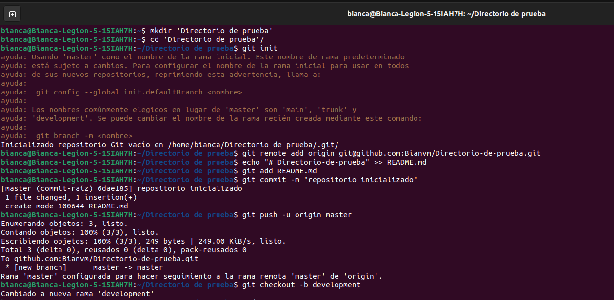
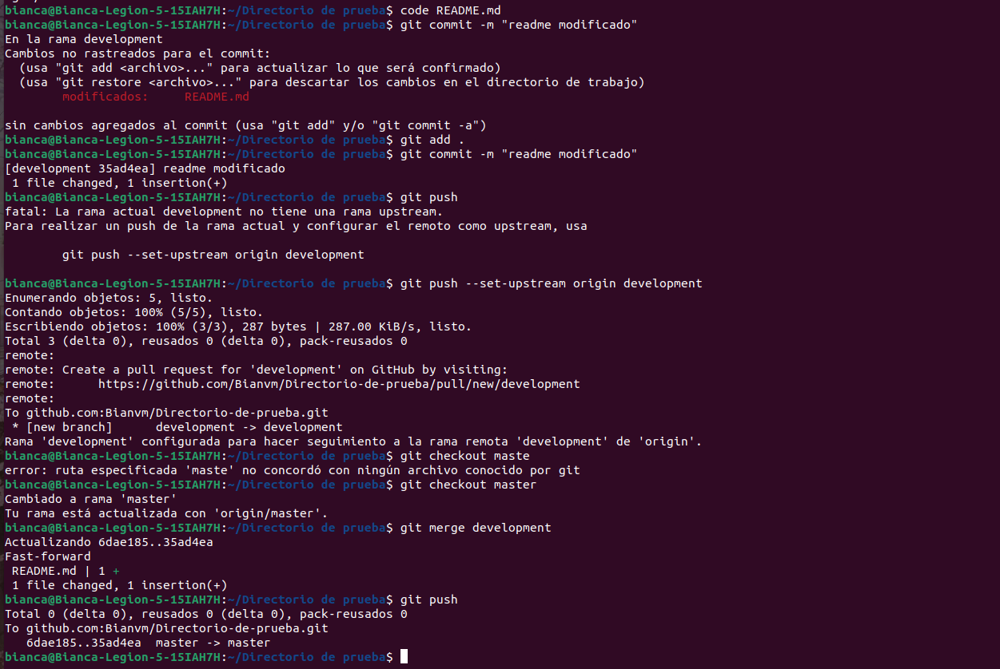

# Directorio-de-prueba
 Crear un repositorio en local y subirlo a GitHub. Luego, deberás crear una rama, hacer un merge y resolver los conflictos que se presenten si fuera el caso. A continuación se muestran las imágenes del procedimiento:

